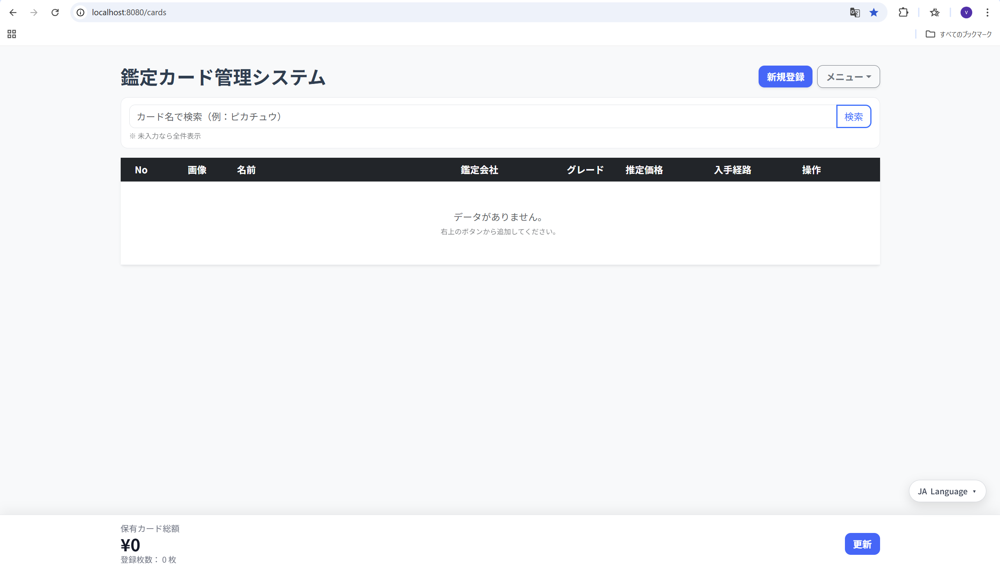

# 鑑定カード管理システム（Graded Card Management System）

個人開発のカード管理Webアプリケーションです。
トレーディングカードの資産管理を効率化することを目的として制作しました。



## 主な機能

* カード情報の登録、編集、削除（PSA / BGS / CGCなど鑑定済みカードに対応）
* 検索機能（カード名による絞り込み）
* 資産価値の自動集計（保有枚数および推定価格の合計を表示）
* 外部マーケットサイトへのリンク（Magi、メルカリ、SNKRDUNKで相場を確認可能）
* 選択したカードの一括削除
* ユーザー登録・ログイン機能
* ユーザーごとのカード情報管理
* 画像アップロード機能
* 多言語表示対応（日本語・中国語・英語）

## 技術スタック

* Backend: Java 17, Spring Boot 3
* Database: MySQL 8.0
* Frontend: Thymeleaf, Bootstrap 5, HTML, CSS, JavaScript
* Build Tool: Maven
* IDE: Eclipse

## 開発の工夫点

* **検索まわりのユーザビリティ**
  検索キーワード入力時にインラインでクリアボタンを表示し、ワンクリックで検索条件をリセットできるようにしました。

* **UIの統一感**
  画面のヘッダーと統計バーを固定し、データ量が増えても操作性が損なわれないようにテーブル表示を調整しました。

* **DB移行**
  開発初期はH2 Databaseを使用していましたが、本番運用を想定してMySQLへ移行しました。環境に合わせてデータベース設定を変更できるようにしています。

* **ユーザーごとのデータ管理**
  ログイン中のユーザーIDをもとに、そのユーザーが登録したカードだけを表示するようにしました。

* **権限チェック**
  編集・削除処理では、カードのuserIdとログインユーザーのidを確認し、他のユーザーのカードを操作できないようにしました。

* **画像アップロード**
  画像ファイルはフォルダに保存し、データベースには画像パスを保存する構成にしました。
  また、アップロード時にファイル名をUUIDでリネームし、同名ファイルの上書きを防止しています。

## ローカル環境での起動方法

1. 本リポジトリをクローンします。

```bash
git clone https://github.com/Vicnent0714/graded-card-manager.git
```

2. プロジェクトフォルダへ移動します。

```bash
cd graded-card-manager
```

3. `src/main/resources/application.properties` を開き、自身のMySQL環境に合わせて設定します。

```properties
spring.datasource.url=jdbc:mysql://localhost:3306/cardmanager
spring.datasource.username=your_username
spring.datasource.password=your_password
```

4. プロジェクトのルートディレクトリで以下のコマンドを実行します。

```bash
./mvnw spring-boot:run
```

Windowsの場合は、以下のコマンドでも起動できます。

```bash
mvnw.cmd spring-boot:run
```

5. ブラウザで以下にアクセスします。

```text
http://localhost:8080/cards
```

## 今後の改善予定

* Service層を追加し、Controllerの処理を整理する
* 価格データを文字列型から数値型へ変更する
* パスワードのハッシュ化対応
* 相場履歴テーブルを追加し、価格推移を確認できるようにする
* UIデザインの改善
* デプロイ環境への対応

## 制作背景

私自身がトレーディングカードを収集しており、カードが増えるにつれて、カード名、鑑定会社、グレード、証明番号、価格、画像、入手経路などを一元管理する必要性を感じました。

また、カードの相場を確認する際に複数のサイトを開く手間があったため、カードごとに検索キーワードを登録し、外部マーケットサイトへ素早くアクセスできる仕組みを実装しました。

このプロジェクトでは、UIデザイン経験を活かしながら、Java、Spring Boot、データベース連携を学ぶことを目的としています。
